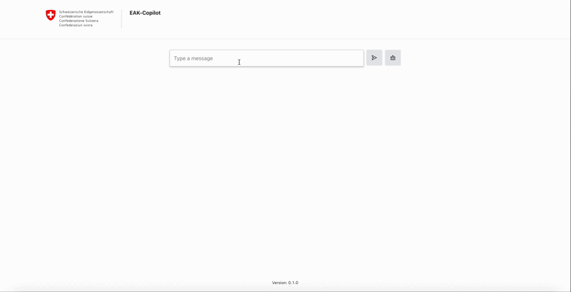

.. EAK-Copilot documentation master file, created by
   sphinx-quickstart on Wed May  8 15:07:56 2024.
   You can adapt this file completely to your liking, but it should at least
   contain the root `toctree` directive.

Welcome to ZAS/EAK-Copilot's documentation!
###########################################

ZAS/EAK-Copilot challenge is developed as part of the `Innovation Fellowship 2024 <https://www.innovationfellowship.ch/>`_. This project is designed to enhance workplace efficiency and foster innovation by providing AI-supported tools that assist employees in their daily tasks.

The current project serves as a proof of concept (PoC), which is slated to conclude in February 2025. However, we are optimistic that the momentum generated by this innovative challenge will attract continued support and development beyond this timeframe.

Demo
====

.. toctree::
   :maxdepth: 2
   :caption: Introduction
   :hidden:

   introduction/intro
   introduction/start
   introduction/updates

.. toctree::
   :maxdepth: 2
   :caption: Guidelines
   :hidden:

   guidelines/opensource
   guidelines/pydoc
   guidelines/sphinx

.. toctree::
   :maxdepth: 2
   :caption: Documentation
   :hidden:

   documentation/api
   documentation/indexing/index
   documentation/survey/index
   documentation/rag/index
   documentation/chatbot/index
   documentation/autocomplete/index
   documentation/gui/index

.. toctree::
   :maxdepth: 2
   :caption: Links
   :hidden:

   🚀 Github <https://github.com/CdC-SI/eak-copilot>