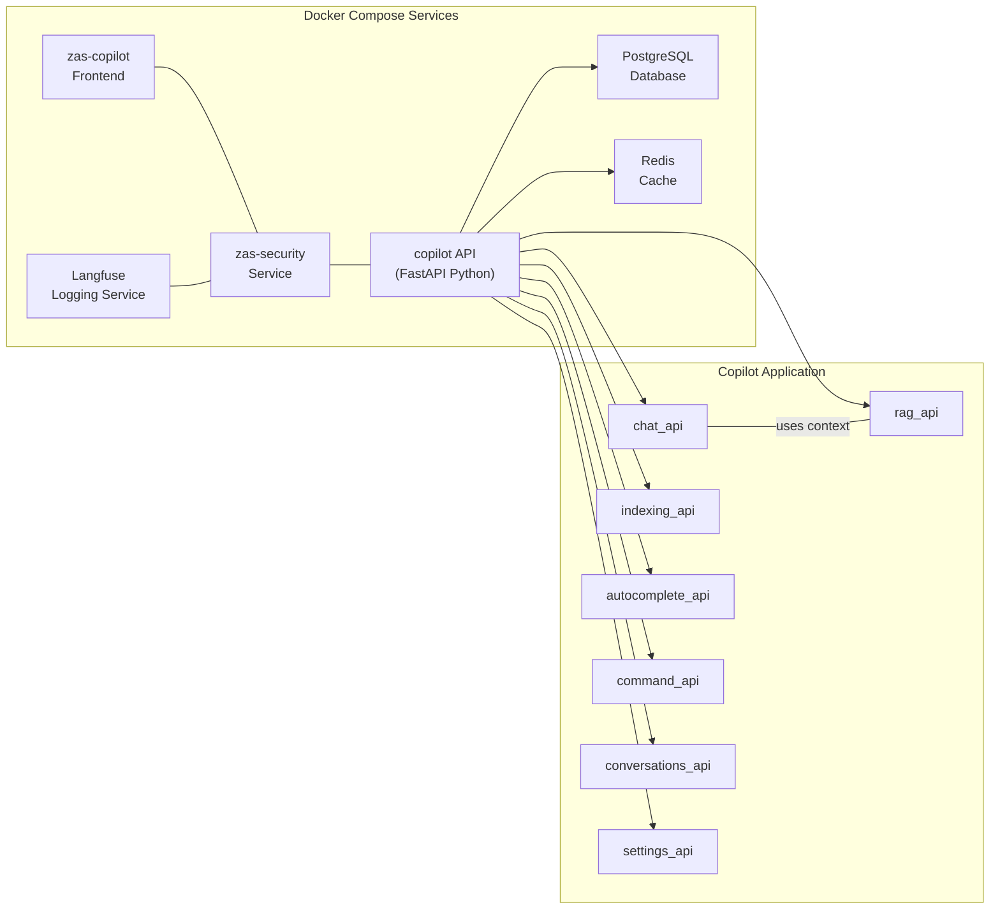
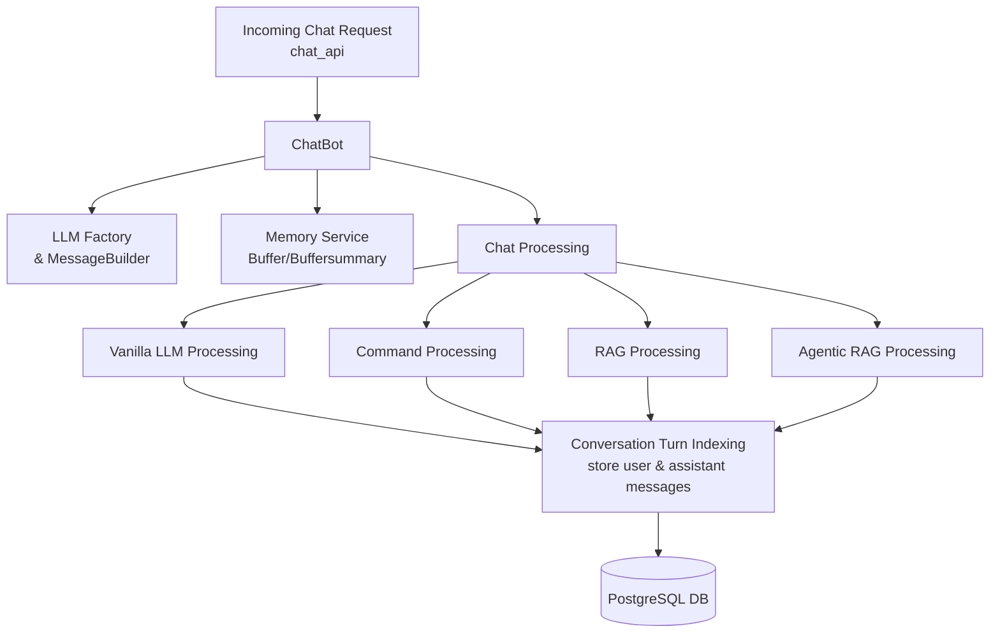
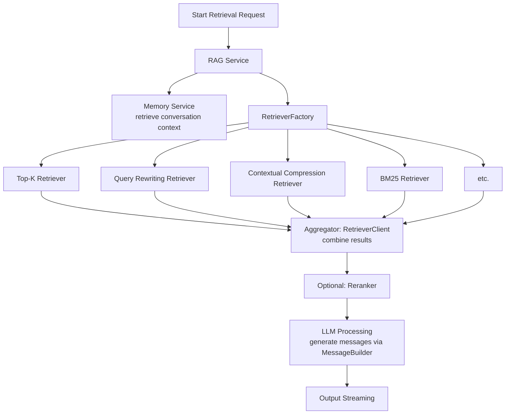
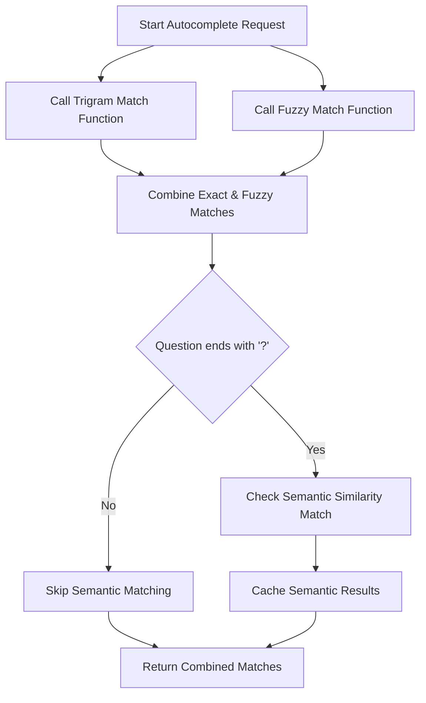
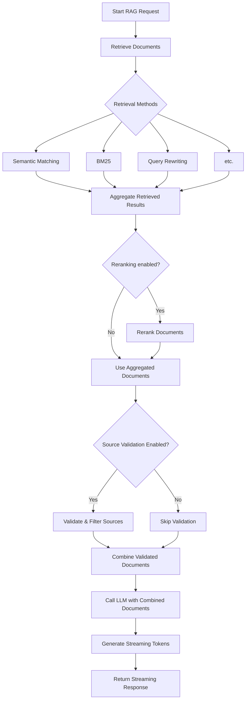
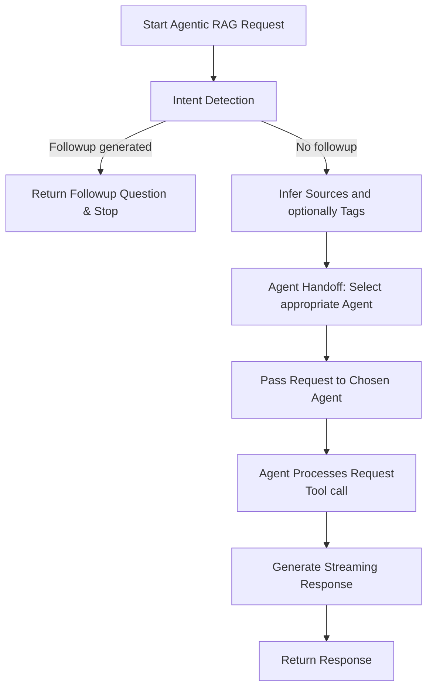
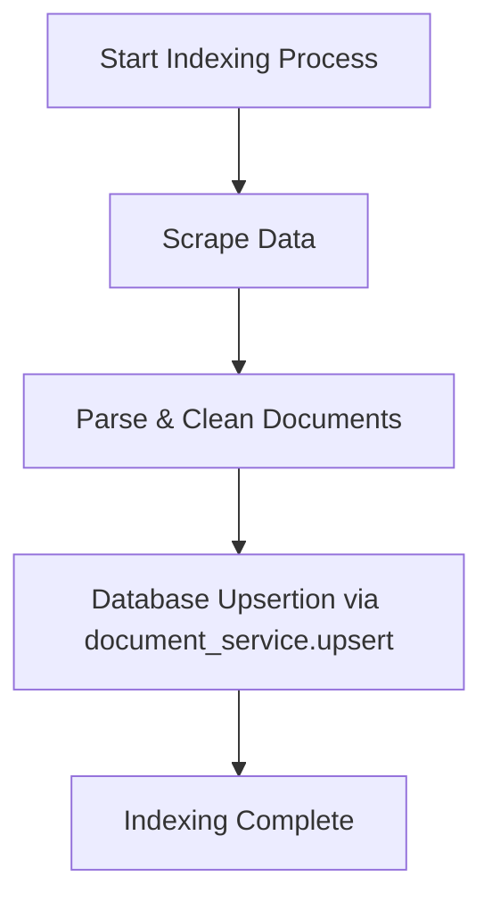

# Copilot architecture

## Overall Architecture (High-Level)

The “Docker Compose Services” subgraph represents the core infrastructure:
- Database (PostgreSQL DB)
- copilot API container (which runs the core FastAPI application)
- zas-security (the backend security service)
- zas-copilot (the frontend service for the Copilot application)
- Langfuse (used for logging/observability)
- Redis (used as an in-memory cache)

Within the copilot API container, there is a “Copilot Application Modules” subgraph representing the main functional modules:
- chat_api
- rag_api
- indexing_api
- autocomplete_api
- command_api
- conversations_api
- settings_api

The copilot container interacts with the database and Redis for persistence and caching.
- The security service (zas-security) and the frontend (zas-copilot) interact with the copilot container.
- Langfuse is connected to the security service for logging/observability.
- Internally, some modules interact.

## Chat Processing Pipeline

## Retrieval Pipeline

# Copilot workflows

## Autocomplete

## RAG

## Agentic RAG

## Indexing

